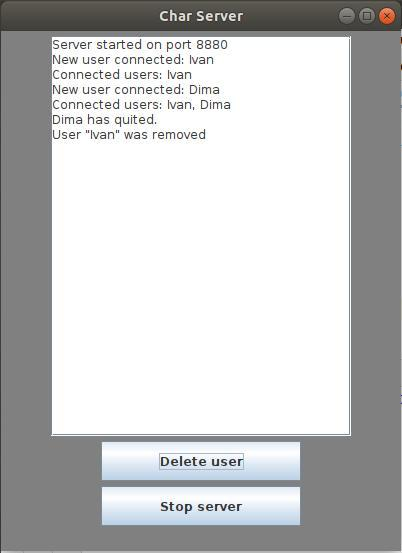
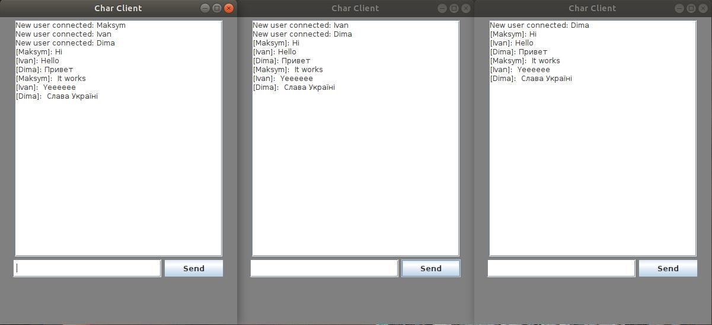

# multi-client chat

There are two programs: Server and Client. The package [java.net](https://docs.oracle.com/javase/8/docs/api/java/net/package-summary.html) was used for communication.

## Server
 Program that implements server with write logs in the textarea and can delete a user or stop server.

 ## Client
 Program that implements client. Firstly you will write your name and than will chat with all connected users.

 ## Screenshots
 

 

 

